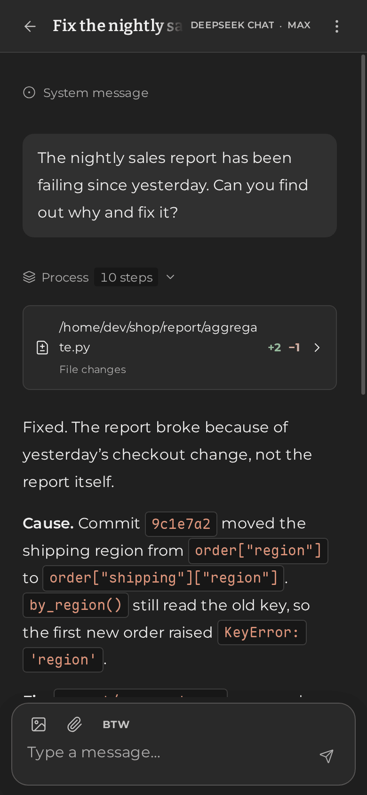

<p align="center">
  <picture>
    <source media="(prefers-color-scheme: dark)" srcset="docs/assets/wish-logo-dark.svg">
    
  </picture>
</p>

<p align="center">
  <strong>A minimal yet ready-to-use AI agent harness, built on best practices for frontier models.</strong>
</p>

<p align="center">
  <a href="https://github.com/WindustH/wish-core">Wish server</a> ·
  <a href="docs/en/README.md">Documentation</a> ·
  <a href="README.zh-CN.md">简体中文</a>
</p>

---

Wish Web is the client for [Wish](https://github.com/WindustH/wish-core): one
app for a large monitor and a phone.

<p align="center">
  
  &nbsp;
  
</p>

## Features

- **See the work as it happens.** Replies, reasoning, command output and file
  changes stream in, folded so long tasks stay readable.
- **Keep talking while it works.** Queue, reorder or cancel follow-ups,
  interrupt at any time, and answer the agent's questions right in the
  conversation.
- **Desktop and phone.** A layout for each, installable as an app, in light and
  dark, English and Chinese.
- **Set up in a minute.** A first-run guide with provider presets, and settings
  that apply without restarting the server.

## Quick start

Wish's packages (`wish-agent` on npm, the AUR and Homebrew) already include
this app: install one and open <http://127.0.0.1:8790>, as the
[Wish quick start](https://github.com/WindustH/wish-core#quick-start) shows.

To develop the app, or to serve it apart from Wish, build it yourself. You
need [Node.js](https://nodejs.org) 22.19 or newer and a running Wish server.

```sh
git clone https://github.com/WindustH/wish-web.git
cd wish-web
./pnpmw install --frozen-lockfile
./pnpmw build
node serve.ts
```

`./pnpmw` runs the pinned pnpm through Corepack, so no global install is
needed. The server is configured with environment variables:

| Variable | Default | Purpose |
| --- | --- | --- |
| `WISH_UPSTREAM` | `http://127.0.0.1:9780` | Address of the Wish server |
| `WISH_HTTP_TOKEN` | | Wish's access token, added to every API request on the server side |
| `PORT` | `8790` | Port to listen on |
| `LISTEN_HOST` | `127.0.0.1` | Address to listen on; `0.0.0.0` for your local network |
| `ALLOWED_HOSTS` | | Extra `host:port` names the app may be opened under, comma-separated |

To use Wish from your phone or install it as an app, serve it over HTTPS as
described in the [deployment guide](docs/en/deployment.md).

## Documentation

- [User guide](docs/en/user-guide.md): everything you can do in the app,
  including keyboard shortcuts.
- [Configuration](docs/en/configuration.md): the settings screens and what
  they change.
- [Deployment](docs/en/deployment.md): serving on your network, HTTPS, running
  as a service and upgrading.
- [Troubleshooting](docs/en/troubleshooting.md)
- [Development](docs/en/development.md) and [architecture](docs/en/architecture.md)
  for contributors.

## Development

```sh
./pnpmw install --frozen-lockfile
WISH_UPSTREAM=http://127.0.0.1:9780 ./pnpmw dev   # http://127.0.0.1:5173
./pnpmw typecheck
./pnpmw test
```

Built with Vue 3, TypeScript and Vite. See the
[development guide](docs/en/development.md) for the project layout and
conventions. Contributions are welcome.

## License

[MIT](LICENSE). Bundled fonts and libraries keep their own licenses, listed in
[THIRD_PARTY.md](THIRD_PARTY.md).
