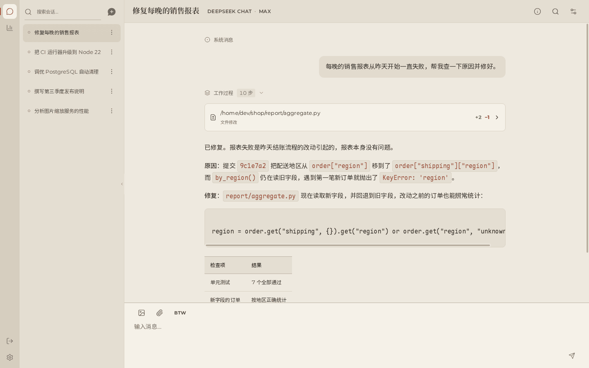
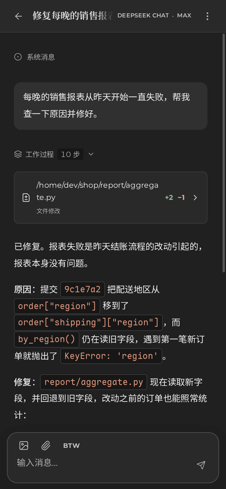

<p align="center">
  <picture>
    <source media="(prefers-color-scheme: dark)" srcset="docs/assets/wish-logo-dark.svg">
    
  </picture>
</p>

<p align="center">
  <strong>Wish AI 智能体的桌面与移动端应用。</strong>
</p>

<p align="center">
  <a href="https://github.com/WindustH/wish-core">Wish 服务端</a> ·
  <a href="docs/zh/README.md">文档</a> ·
  <a href="README.md">English</a>
</p>

---

Wish Web 是 [Wish](https://github.com/WindustH/wish-core) 的客户端。Wish 是一个运行在你自己机器上的自托管 AI 智能体。
Wish Web 把它长期运行的会话变成一个安静、专注的对话工作台，无论在大屏显示器上还是在手机上都用得顺手。

<p align="center">
  
  &nbsp;
  
</p>

## 功能

- **看着智能体思考和干活。** 回复边写边显示，推理过程实时可见。每条命令都会展示输出、退出码以及对文件的具体改动，
  并整齐地折叠起来，长任务也能保持清晰易读。
- **它工作时你也能继续说。** 追加的消息会排队，可以拖动调整顺序、编辑或取消。按 Esc 即可中断；
  也可以在气泡里问一个“顺便问一下”的小问题，不打扰正在进行的任务。
- **丰富的输入方式。** 图片和文件可以直接粘贴或插入到消息中的任意位置；大段粘贴的文本会收起成整洁、可编辑的标签。
- **什么都找得到。** 检索会话的全部历史，一键跳到对话中的那个时刻。
- **掌控每一个会话。** 随时看到上下文占用了多少、离自动压缩还有多远；可以为单个会话调整压缩参数和 Shell，
  也可以在任务进行中切换模型。
- **用量一目了然。** 活跃日历、任意时间范围内各模型的 Token 用量、估算的流式速度，以及服务状态和存储占用。
- **一分钟完成设置。** 首次使用引导内置 48 个提供商预设，支持 ChatGPT 登录、模型编辑、代理和 Shell 设置，
  全部无需重启服务即可生效。
- **为手机而设计。** 专门的移动端布局，可以安装成应用；支持浅色和深色主题，以及中文和英文界面。
- **长历史依然流畅。** 虚拟列表让超长对话也能顺畅滚动；最近的数据从缓存中立即显示，新数据到达后再替换。
- **一个应用，多台服务器。** 退出后填写另一台 Wish 服务器的地址和访问令牌即可连接，同一个安装好的应用就能访问你所有运行 Wish 的机器。
- **放心对外提供服务。** 自带的服务器把访问令牌留在服务端，只响应你允许的主机名，并拦截跨站请求。

## 快速开始

需要 [Node.js](https://nodejs.org) 22.19 或更高版本，以及一个正在运行的 Wish 服务端，参见
[Wish 快速开始](https://github.com/WindustH/wish-core/blob/master/README.zh-CN.md#快速开始)。

```sh
git clone https://github.com/WindustH/wish-web.git
cd wish-web
./pnpmw install --frozen-lockfile
./pnpmw build
node serve.mjs
```

打开 <http://127.0.0.1:8790>。首次使用引导会帮你添加模型提供商；之后在首页选择工作目录，发送第一条消息即可。

`./pnpmw` 通过 Corepack 运行项目锁定版本的 pnpm，无需全局安装。服务器通过环境变量配置：

| 变量 | 默认值 | 用途 |
| --- | --- | --- |
| `WISH_UPSTREAM` | `http://127.0.0.1:9780` | Wish 服务端地址 |
| `WISH_HTTP_TOKEN` | | Wish 的访问令牌，由服务器端附加到每个 API 请求上 |
| `PORT` | `8790` | 监听端口 |
| `LISTEN_HOST` | `127.0.0.1` | 监听地址；局域网访问时设为 `0.0.0.0` |
| `ALLOWED_HOSTS` | | 允许用来打开应用的其他 `主机:端口`，用逗号分隔 |

如果要在手机上使用或安装成应用，请按照[部署指南](docs/zh/deployment.md)通过 HTTPS 提供服务。

## 文档

- [使用指南](docs/zh/user-guide.md)：应用里能做的所有事情，包括键盘快捷键。
- [配置](docs/zh/configuration.md)：各个设置页面及其作用。
- [部署](docs/zh/deployment.md)：局域网访问、HTTPS、以服务方式运行和升级。
- [故障排查](docs/zh/troubleshooting.md)
- 面向贡献者的[开发指南](docs/zh/development.md)和[架构说明](docs/zh/architecture.md)。

## 开发

```sh
./pnpmw install --frozen-lockfile
WISH_UPSTREAM=http://127.0.0.1:9780 ./pnpmw dev   # http://127.0.0.1:5173
./pnpmw typecheck
./pnpmw test
```

基于 Vue 3、TypeScript 和 Vite 构建。项目结构和约定见[开发指南](docs/zh/development.md)。欢迎参与贡献。

## 许可证

[MIT](LICENSE)。随应用分发的字体和库遵循各自的许可证，见 [THIRD_PARTY.md](THIRD_PARTY.md)。
