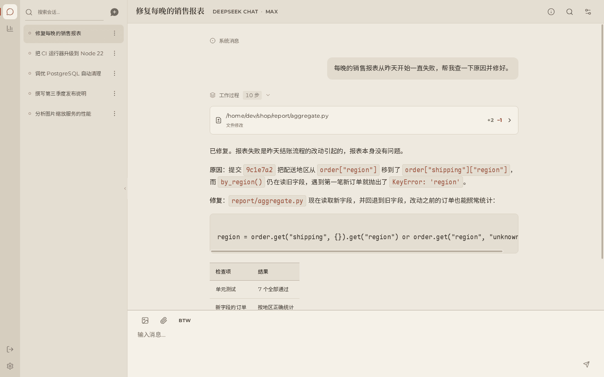

<p align="center">
  <picture>
    <source media="(prefers-color-scheme: dark)" srcset="docs/assets/wish-logo-dark.svg">
    
  </picture>
</p>

<p align="center">
  <strong>一个极简但开箱即用的 AI Agent Harness，采用贴合前沿模型的优秀实践。</strong>
</p>

<p align="center">
  <a href="https://github.com/WindustH/wish-core">Wish 服务端</a> ·
  <a href="docs/zh/README.md">文档</a> ·
  <a href="README.md">English</a>
</p>

---

Wish Web 是 [Wish](https://github.com/WindustH/wish-core) 的客户端：一个应用，大屏显示器和手机上都好用。

<p align="center">
  
  &nbsp;
  
</p>

## 功能

- **工作过程实时可见。** 回复、推理、命令输出和文件改动边做边显示，并折叠整齐，长任务也清晰易读。
- **它工作时你也能继续说。** 追加的消息可以排队、调整顺序或取消，随时可以中断，智能体的提问直接在对话里回答。
- **桌面和手机。** 各有专门的布局，可以安装成应用；支持浅色和深色主题，以及中文和英文界面。
- **一分钟完成设置。** 首次使用引导内置提供商预设，设置无需重启服务即可生效。

## 快速开始

Wish 的安装包（npm、AUR 和 Homebrew 上的 `wish-agent`）已经包含这个应用：装好后打开
<http://127.0.0.1:8790> 即可，参见 [Wish 快速开始](https://github.com/WindustH/wish-core/blob/master/README.zh-CN.md#快速开始)。

如果要开发这个应用，或者把它和 Wish 分开部署，就自己构建。需要 [Node.js](https://nodejs.org)
22.19 或更高版本，以及一个正在运行的 Wish 服务端。

```sh
git clone https://github.com/WindustH/wish-web.git
cd wish-web
./pnpmw install --frozen-lockfile
./pnpmw build
node serve.ts
```

`./pnpmw` 通过 Corepack 运行项目锁定版本的 pnpm，无需全局安装。服务器通过环境变量配置：

| 变量 | 默认值 | 用途 |
| --- | --- | --- |
| `WISH_UPSTREAM` | `http://127.0.0.1:9780` | Wish 服务端地址 |
| `WISH_HTTP_TOKEN` | | Wish 的访问令牌，由服务器端附加到每个 API 请求上 |
| `PORT` | `8790` | 监听端口 |
| `LISTEN_HOST` | `127.0.0.1` | 监听地址；局域网访问时设为 `0.0.0.0` |
| `ALLOWED_HOSTS` | | 允许用来打开应用的其他 `主机:端口`，用逗号分隔 |

如果要在手机上使用或安装成应用，请按照[部署指南](docs/zh/deployment.md)通过 HTTPS 提供服务。

## 文档

- [使用指南](docs/zh/user-guide.md)：应用里能做的所有事情，包括键盘快捷键。
- [配置](docs/zh/configuration.md)：各个设置页面及其作用。
- [部署](docs/zh/deployment.md)：局域网访问、HTTPS、以服务方式运行和升级。
- [故障排查](docs/zh/troubleshooting.md)
- 面向贡献者的[开发指南](docs/zh/development.md)和[架构说明](docs/zh/architecture.md)。

## 开发

```sh
./pnpmw install --frozen-lockfile
WISH_UPSTREAM=http://127.0.0.1:9780 ./pnpmw dev   # http://127.0.0.1:5173
./pnpmw typecheck
./pnpmw test
```

基于 Vue 3、TypeScript 和 Vite 构建。项目结构和约定见[开发指南](docs/zh/development.md)。欢迎参与贡献。

## 许可证

[MIT](LICENSE)。随应用分发的字体和库遵循各自的许可证，见 [THIRD_PARTY.md](THIRD_PARTY.md)。
